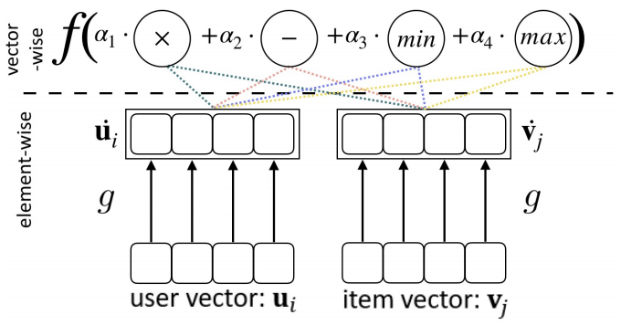

# SIF (Search for Interaction Functions)
Code accompanying the paper  

[WWW'20](https://www2020.thewebconf.org/): ***Efficient Neural Interaction Function Search for Collaborative Filtering*** [paper](https://arxiv.org/abs/1906.12091) [slides](https://pan.baidu.com/s/1XyJb5Nc9ZMUz_dq9c767Ug)
Quanming Yao*, Xiangning Chen*, James Kowk, Yong Li, Cho-Jui Hsieh



If you find this code useful in your research please cite

```
@misc{yao2019efficient,
    title={Efficient Neural Interaction Function Search for Collaborative Filtering},
    author={Quanming Yao and Xiangning Chen and James Kwok and Yong Li and Cho-Jui Hsieh},
    year={2019},
    eprint={1906.12091},
    archivePrefix={arXiv},
    primaryClass={cs.LG}
}
```

## Setup
MovieLens-100K, MovieLens-1M and MovieLens-10M datasets are publicly available [here](https://grouplens.org/datasets/movielens/). The Youtube dataset is introduced in this [paper](https://ieeexplore.ieee.org/abstract/document/5360276).
The main environment is:

* CUDA 9.0
* torch 1.1.0
* numpy 1.14.0

To run baselines, these packages are required:

* [tffm](https://github.com/geffy/tffm)
* [hyperopt](https://github.com/hyperopt/hyperopt)
* tensorflow 1.15.2

## Architecture Search
* SIF

```python main_search.py --mode=sif --dataset=ml-100k```

* Baseline (examples)

```python main_search.py --mode=random --dataset=ml-100k # Random```
```python main_search.py --mode=hyperopt --dataset=ml-100k # Bayesian Optimization``` 

## Architecture Evaluation
* SIF

```python main_evaluate.py --mode=sif --dataset=ml-100k --arch=searched_model_path```

* Baseline (examples)

```python main_evaluate.py --mode=ncf --dataset=ml-100k    # Neural Collaborative Filtering```
```python main_evaluate.py --mode=libfm --dataset=ml-100k # Factorization Machine```

## Related publications:
* Q. Yao, J. Xu, W. Tu, Z. Zhu. Efficient Neural Architecture Search via Proximal Iterations. AAAI Conference on Artificial Intelligence (AAAI). 2020 [paper](https://arxiv.org/abs/1905.13577) [code](https://github.com/xujinfan/NASP-codes)
* Y. Zhang, Q. Yao, W. Dai, L. Chen. AutoSF: Searching Scoring Functions for Knowledge Graph Embedding. IEEE International Conference on Data Engineering (ICDE). 2020. [paper](https://128.84.21.199/abs/1904.11682) [code](https://github.com/yzhangee/AutoSF)
* Q. Yao, M. Wang, et.al. Taking Human out of Learning Applications: A Survey on Automated Machine Learning. Arvix 2018. [paper](https://arxiv.org/abs/1810.13306)


